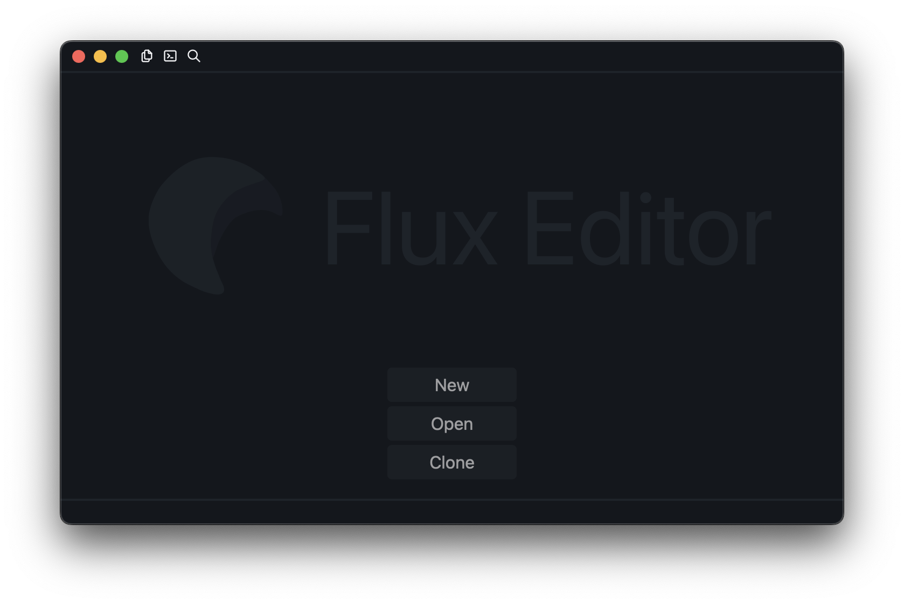
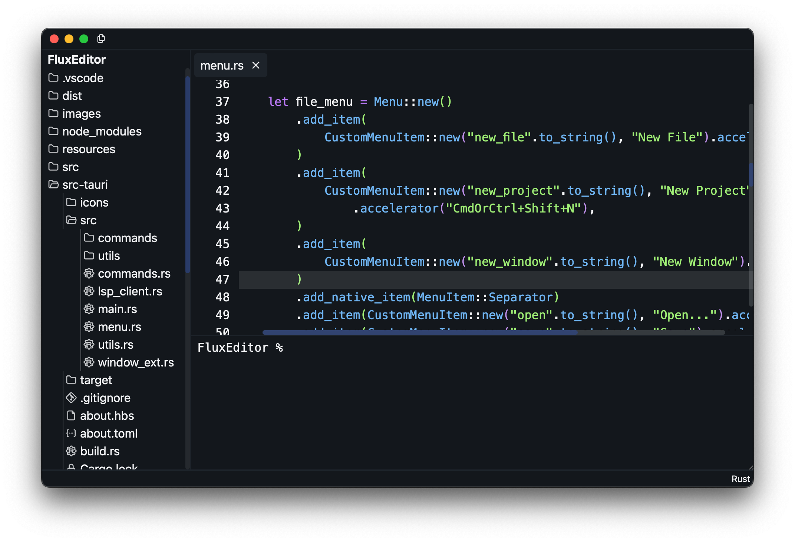

> [!NOTE]
> This project is still in beta. Expect bugs and unfinished features.

## Screenshots

<div align="center">


</div>

## Table of Contents

- [Features](#features)
- [Installation](#installation)
- [Known Issues](#known-issues)
- [Contributors](#contributors)
- [Contributing](#contributing)
- [Credits](#credits)
- [Copyright and Licenses](#license)

## Features <a name="features"></a>

- Syntax highlighting
- Built-in file browser
- Built-in terminal
- Code suggestions (soon)
- Git integration (partially complete)
- Very fast
- Minimalist UI
- and many more!

## Installation <a name="installation"></a>

You can find built binaries in the [Releases](https://github.com/kyteidev/FluxEditor/releases) page.

> [!WARNING]
> I don't have an Apple Developer account yet. You may encounter a popup that says Apple cannot verify this app or this app is damaged. To bypass these dialogs, read below.
> If you don't trust the builds, you can always build Flux Editor from source. See [CONTRIBUTING.md](https://github.com/kyteidev/FluxEditor/blob/dev/CONTRIBUTING.md) for instructions

### Running unsigned applications on macOS

> [!WARNING]
> **DISCLAIMER: I AM NOT RESPONSIBLE OF ANYTHING THAT HAPPENS TO YOUR COMPUTER AS A RESULT OF THE FOLLOWING GUIDE. ALWAYS MAKE SURE THE APPLICATION YOU ARE RUNNING IS SAFE AND FROM A TRUSTED SOURCE. USE AT YOUR OWN RISK.**

Since I do not have an Apple Developer account, I am unable to sign Flux Editor. This results in users getting a popup that says the app cannot be verified or the app is damaged. However, these popups can be bypassed, but ALWAYS remember to check if the unsigned app you are running is safe and from a trusted source.

To bypass the popup, Click **Okay**, then go to **System Settings** > **Privacy and Security**, scroll down and click **Open Anyway**.

If you are getting a popup that says the app is damaged, it basically means the same thing as "this app cannot be verified". Apple reworded the popup and made it harder for users to bypass it in the latest versions of macOS. To bypass this, run ```xattr -d com.apple.quarantine /path/to/app```

## Known Issues <a name="known-issues"></a>

- Caret height is not correct on the first line in the editor (probably webview issue)
- Terminal will reset when closing all tabs or opening first tab
- Settings not working properly

## Contributing <a name="contributing"></a>

See [CONTRIBUTING.md](https://github.com/kyteidev/FluxEditor/blob/dev/CONTRIBUTING.md).

## Credits <a name="credits"></a>

- Syntax highlighting is powered by PrismJS
- The search bar was inspired by VSCode and Zed

Special thanks to everyone who contributed to this project :)

## Copyright and Licenses <a name="license"></a>

Copyright © 2024-2025 [kyteidev](https://github.com/kyteidev/). Licensed under [GNU General Public License v3.0](https://github.com/kyteidev/FluxEditor/blob/dev/LICENSE).

The original designer of the Flux Editor Logo is [kyteidev](https://github.com/kyteidev/).

The Flux Editor Logo and its color variants are available under the [Creative Commons Attribution-NonCommercial-ShareAlike License](https://creativecommons.org/licenses/by-nc-sa/4.0/).
